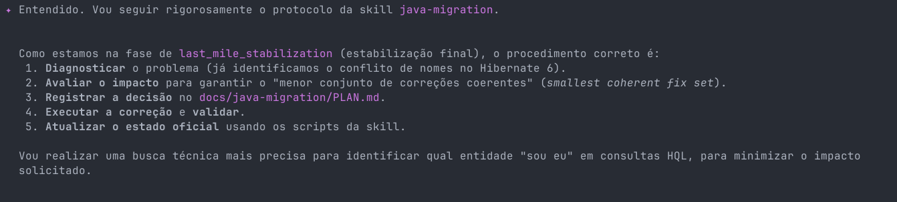

# Java Agentic Migration Kit

Repositório-fonte único do kit reutilizável de migração orientada a IA.

## Skill final

- `java-migration/`

Formato da skill:

- `java-migration/SKILL.md`
- `java-migration/agents/openai.yaml`
- `java-migration/scripts/`
- `java-migration/references/`

## Regras do repositório

- esta árvore é a única fonte de verdade do kit
- a skill instalável futura é `java-migration/`
- o output de cada projeto continua em `docs/java-migration`
- o kit é `Maven-first` em `v1`, com foco principal em Java EE -> Jakarta EE
- todo fluxo operacional deve depender de estado em disco, não de conversa anterior
- o kit deve operar com budget de contexto: handoff aos 40% e teto duro aos 50%
- tudo que for repetível e determinístico deve morar em `scripts/`, `references/` ou contratos
- a orquestração textual reutilizável da skill deve morar principalmente em `java-migration/SKILL.md`
- cada repositório migrado deve manter seu plano vivo em `docs/java-migration/PLAN.md`

## Fluxo da skill

`java-migration` concentra, por fase:

- bootstrap
- discovery
- planning
- OpenRewrite execution
- last-mile stabilization
- controlled fallback

Estrutura recomendada:

- skill instalada
  `SKILL.md` como entrada e contrato operacional reutilizável
  `scripts/` e contratos como fonte de comportamento determinístico
  `references/` para templates, contratos e presets reutilizáveis
- projeto migrado
  `docs/java-migration/PLAN.md` como plano vivo da migração
  `docs/java-migration/state/*.json` como estado estruturado
  `docs/java-migration/discovery-protocol/` como evidência e manifests

Os artefatos oficiais continuam em:

- `docs/java-migration/PLAN.md`
- `docs/java-migration/state/project.state.json`
- `docs/java-migration/state/active-milestone.json`
- `docs/java-migration/state/session-handoff.md`
